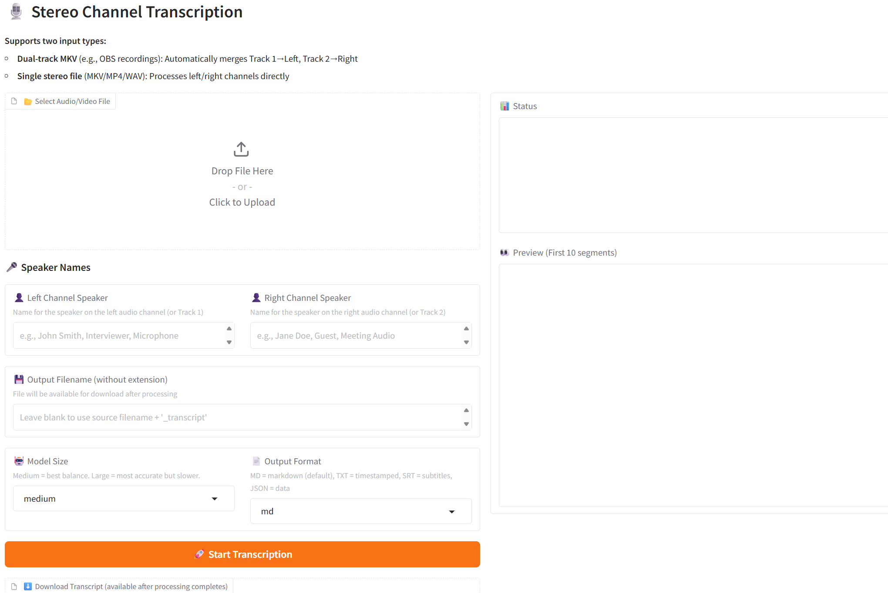

#### MKV2Transcript

This is basically the software part of a post that I did to Reddit explaining how to set up OBS Studio to capture both sides of a Google Meet meeting. In essence, you can use OBS Studio to record the stereo track coming from you and the stereo track coming from everybody else on the phone call. Unfortunately, you end up with two stereo tracks where if you want to use the inputs from the two sides as two clear different speakers, it's not quick and easy to pull this out.

[If you follow the Reddit post](https://www.reddit.com/r/StrategicProductivity/comments/1qfiom3/obs_studio_and_mkv_multitrack_audio_to_build/), you will now have a special MKV file. This GitHub and the Docker image it produces is designed to process the file that comes out of OBS Studio as per that post. As always, to be legally compliant, you always need to tell somebody that you are recording and then you plan to transcript the call. Once you have this, the package takes the audio file, places it onto two separate audio tracks, and then it basically identifies yourself and everybody else in a transcript. It outputs it as a markdown file, which you can send to any LLM to process it, give you and outline and action items.

MKV2Transcript is a stereo channel transcription tool that runs entirely inside a Docker container and exposes a browser-based UI on your local machine. It is designed and scripted for **Windows** 11 with Docker Desktop, and users on other operating systems will need to adapt the `docker-compose.yml` and startup scripts accordingly.

#### Why Docker Makes This Simple

Once you learn how to use Docker, it simplifies your tremendously. And the Good News this Github is that it has basically everything you need so that you can set it up in Windows 11 and double click a batch file to launch it.

You do not need to install Python, FFmpeg, or any machine learning libraries on your own machine; everything required is bundled inside the Docker image.  Dependency versions and system-level packages are controlled by the Dockerfile, so you avoid "it works on my machine" issues and conflicting Python environments.  Upgrading the app is as simple as pulling or rebuilding the image, without manually reinstalling packages on your host.

I did push a version of this to Docker Hub as https://hub.docker.com/r/sanbornyoung/mkv2transcript but I may not keep it sync'ed as version 2.0.0.

#### Features

- **Dual-track support**: Automatically merges OBS dual-track recordings.
- **Single stereo support**: Processes standard stereo files.
- **Multiple output formats**: Markdown, TXT, SRT, JSON.
- **Configurable defaults**: Optional JSON config file for personalized settings.
- **Cross-platform core**: Containerized Python app can run on Windows, Linux, and macOS with Docker.

#### Architecture Overview

- The container image is built from `python:3.11-slim`, installs `ffmpeg`, and adds the Python dependencies `faster-whisper`, `gradio`, `pandas`, and `tqdm` inside the image.
- The image sets `WORKDIR /app`, copies `app.py` into `/app`, defines a mount point at `/data`, exposes port `7860`, and runs the application with `python app.py`.
- `docker-compose.yml` defines a single service named `mkv2transcript` that builds from the local `Dockerfile`, publishes container port `7860` to host port `7860`, and sets `GRADIO_SERVER_NAME=0.0.0.0` so the Gradio app listens on all interfaces.
- The compose file uses environment variables from `.env` to mount your chosen directory into the container at `/data` and mounts a local `./whisper-models` directory into `/root/.cache/huggingface` for model caching.
- On Windows 11, `MKV2TranscriptUp.bat` and `MKV2TranscriptDown.bat` are convenience scripts that check whether Docker Desktop is running and then call `docker-compose up -d` or `docker-compose down` to control the container.

##### Update:  Moved To Faster Whisper

Note to Self:  I was thinking this would be short calls, but then realized it actually was pretty cool, so I decided to upgrade performance, and went from Whisper to WhisperX to Faster-Whisper.  Should have thought this out first.
#### Prerequisites (Host Machine)

- **Windows 11** with Docker Desktop installed and running.
- A web browser to access the Gradio UI at `http://localhost:7860`.
- Sufficient disk space for Whisper models in the `whisper-models` directory and for your media files.

> Note: FFmpeg and Python are installed **inside** the container and are not required on the Windows host, as long as Docker Desktop is available.

#### Repository Setup

1. Clone the repository:
   - `git clone https://github.com/Sanborn-Young/MKV2Transcript.git`
   - `cd MKV2Transcript`

2. **CRITICAL**: Create your `.env` configuration file:
   - Copy the example file: `copy .env.example .env`
   - Edit `.env` with a text editor (Notepad, VS Code, etc.)
   - Update `DATA_PATH` to point to the directory containing your audio/video files
   - For Windows, use forward slashes: `DATA_PATH=C:/Users/YourUsername` or `DATA_PATH=C:/Users/YourUsername/Videos`
   - The `DATA_PATH` directory will be accessible to the application at `/data` inside the container
   - If you read the post on setting up OBS Studio, then the easy thing to do is have the application look at where you are storing your Google Meet OBS MKV files.

3. Ensure Docker Desktop is installed and running on Windows 11 before starting the service.

#### Environment Configuration (.env file)

The `.env` file controls where the application can access your files. This file is NOT included in the repository and must be created by each user.

**Required variables:**

- `DATA_PATH`: The Windows directory path where your video/audio files are located. Use forward slashes.
- `WHISPER_CACHE`: Directory for storing downloaded AI models (default: `./whisper-models`).
- `GRADIO_PORT`: Port for the web interface (default: `7860`).

**Example `.env` for Windows:**

    DATA_PATH=C:/Users/YourUsername/Documents/WEBMEETINGS
    WHISPER_CACHE=./whisper-models
    GRADIO_PORT=7860

**Important notes:**
- Replace `YourUsername` with your actual Windows username.
- You can point to any directory where you store videos: `C:/Videos`, `D:/Recordings`, etc.
- The application will have read/write access to everything under `DATA_PATH`.
- For security, choose a specific folder rather than an entire drive (e.g., `C:/Users/YourUsername` instead of `C:/`).

#### Running on Windows 11 (Recommended Path)

1. Double-click `MKV2TranscriptUp.bat` from the repository root to start the service.
   - The script changes to its own directory, verifies that Docker Desktop is running using `docker info`, and aborts with a clear error message if Docker is not available.
   - If Docker is available, it runs `docker-compose up -d` to build (if needed) and start the `mkv2transcript` container.
2. After the container is up, the script waits briefly, then opens your default browser to `http://localhost:7860` and prints the access URL and status messages.
3. Use the web UI to:
   - Upload your audio/video file (e.g., MKV, MP4, WAV).
   - Configure model, format, and channel naming options.
   - Start the transcription and download the result when complete.
4. To stop the service, run `MKV2TranscriptDown.bat` from the same directory.
   - This script checks Docker status and then calls `docker-compose down` to stop and remove the running container.

> These `.bat` scripts are written specifically for Windows 11 and assume Docker Desktop with the `docker-compose` command on the PATH; users on other platforms must adapt the scripts or invoke Docker manually.

#### The Interface

When invoked, you should be able to see the interface come up in a web browser and it should look as follows.

The first thing to note is this only shows the upper part of the screen. In reality, there is more underneath it, including the ability to reset it and process another file. Secondly, due to the nature of Docker and how it processes stuff, you will need to download the document through the web browser to actually see the transcript. In other words, look at the download box underneath it called "⬇️ Download Transcript (available after processing completes)"
 and up will pop the size of the translated file in blue. Clicking on that you can download it and put it wherever you want.

 Generally, it will try and process any file that you throw at it.  If you accidently don't upload two separate audio tracks, it will text to speech both of them, see that they are duplicates, and only output one of them.  However, I don't preprocess, so it is slow.

 #### Output

 Why you can output in many different formats, it defaults to .md or markdown.  This file is perfect for now givving to an LLM and asking it to summarize and provide and outline of your meeting.  You can also paste it into a package like Obsidian.

#### Running on Other Operating Systems

- The core application runs inside Docker and is compatible with Linux and macOS, but:
  - The provided `MKV2TranscriptUp.bat` and `MKV2TranscriptDown.bat` scripts will not work as-is and must be replaced with appropriate shell scripts or manual commands for your OS.
  - The `.env` file `DATA_PATH` variable needs to be changed to a valid path on your system (for example, `/home/username` on Linux or `/Users/username` on macOS).
- To run manually on non-Windows systems:
  - Install Docker Engine and Docker Compose (or ensure `docker compose` is available).
  - Create your `.env` file from `.env.example` and adjust `DATA_PATH` to match your filesystem layout.
  - From the repository root, run `docker-compose up -d` (or `docker compose up -d`) and then visit `http://localhost:7860` in your browser.

#### Transcription Configuration (Optional)

Create `transcribe_config.json` in the repository root to set default behavior for speaker names and transcription settings. An example file `transcribe_config.example.json` is provided as a template.

**To use:**
1. Copy the example: `copy transcribe_config.example.json transcribe_config.json`
2. Edit `transcribe_config.json` with your preferred defaults
3. Restart the application

Example configuration:

    {
      "default_model": "medium",
      "default_format": "md",
      "default_left_speaker": "Interviewer",
      "default_right_speaker": "Guest"
    }

Options:

- `default_model`: `tiny`, `base`, `small`, `medium`, `large-v2`
- `default_format`: `md`, `txt`, `srt`, `json`
- `default_left_speaker`: Default display name for the left-channel speaker.
- `default_right_speaker`: Default display name for the right-channel speaker.

#### Supported Formats

- **Input**: MKV, MP4, AVI, MOV, WAV, MP3
- **Output**:
  - **Markdown (MD)**: Clean format with timestamps every 5 minutes.
  - **TXT**: Plain text with full timestamps.
  - **SRT**: Subtitle format suitable for video editors.
  - **JSON**: Structured data with full metadata.

#### Performance

- On a Intel 12th Gen Core i7-1260P processor it takes around 8 minutes to get a useful transcript from and hour and 15 minute meeting with tiny model.
- The `medium` model is a total mystery to me. When benchmarked against the tiny model, it takes 20 times as long to get back. And when I take a look at the usefulness of it, it comes back disjointed between the speakers and you need to reassemble it using an LLM to get it to make sense. Hopefully somebody can experiment with this, but right now it would not be something I would suggest for anything.
- The `small` and `tiny` models are significantly faster.

#### License

MIT.

#### Contributing

- Pull requests are welcome; please keep changes compatible with Docker-based deployment.
- When modifying the Dockerfile, `docker-compose.yml`, or Windows batch scripts, ensure that:
  - The Gradio app remains accessible at `http://localhost:7860`.
  - Volume mappings are clearly documented for Windows and non-Windows users.
  - Any changes to ports, paths, or environment variables are reflected in this README and the helper scripts.
